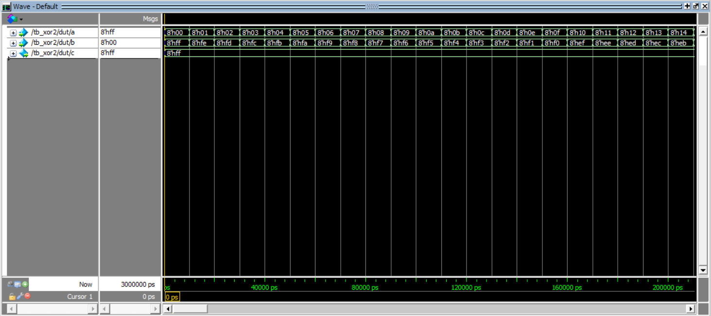
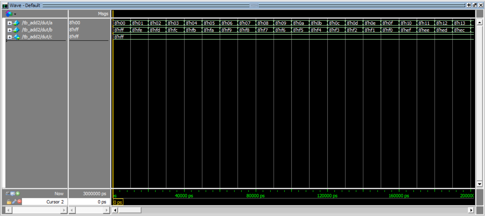
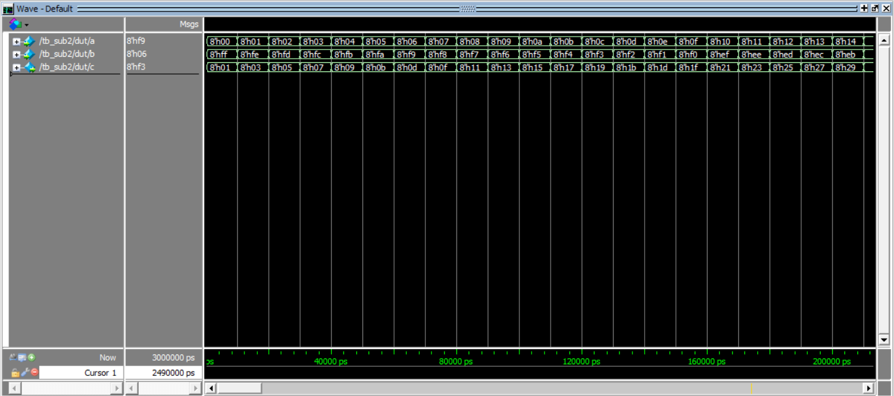

# Lab 1: Instruction Design

## Design

### Goal

Design SystemVerilog modules that perform specific instructions for two 8-bit input data

### Implementation

- [xor2.sv](xor2.sv) (`xor` instruction)
- [add2.sv](add2.sv) (`add` instruction)
- [sub2.sv](sub2.sv) (`sub` instruction)

## Testbench

### Goal

Make testbench codes for the above designs

### Testcase

Each testbench design should have two separate
input signals, a[7:0] and b[7:0].

- Input a increases from 0 to the maximum value every 10 ns.
- input b decreases from the maximum value to 0 every 10 ns.

### Implementation

- [tb_xor2.sv](tb_xor2.sv)
- [tb_add2.sv](tb_add2.sv)
- [tb_sub2.sv](tb_sub2.sv)

### Result

